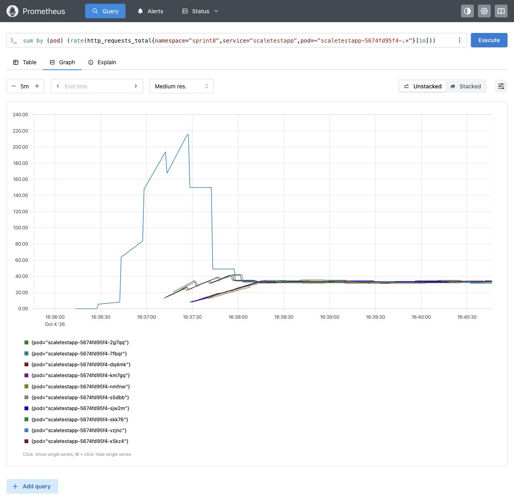
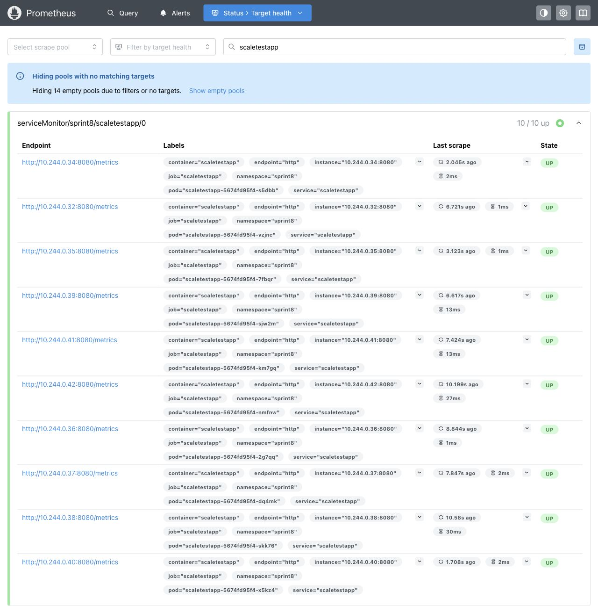

# Проверка масштабирования

Проверила на Minikube 1.38.1, Kubernetes 1.35.1, драйвер vfkit с Rosetta, 3 CPU и 6 GiB памяти. Использовался оригинальный amd64-образ Практикума:

`ghcr.io/yandex-practicum/scaletestapp@sha256:7273dd1ffd1c1a29a307eb299b949f71828952b90dee42a5b26b052e92793452`.

Лимит памяти — 30 MiB, запрос — 16 MiB. Locust работал отдельным Job в Kubernetes: 1000 пользователей, разгон 50/с, пять минут, GET через ClusterIP Service, пауза между запросами 1–5 секунд. Время в именах логов и строках наблюдения — UTC.

## Память

[Полный лог](memory-20261004T162536Z.log), 16:25:36–16:32:25 UTC. Перед нагрузкой одна реплика, первая метрика — 12 MiB. Под нагрузкой HPA с целью 80% увеличил число реплик: 1 → 2 → 3 → 5 → 7 → 10. В конце все десять pod готовы, перезапусков нет. Locust: 97 501 запрос, 0 ошибок, средние 325,09 RPS, p95 4 мс. Это измерения учебного стенда, не производительности корпоративной системы.

Память не обязана сразу уменьшаться после нагрузки: runtime сохраняет выделенные страницы. Поэтому для этого HTTP-сервиса RPS лучше отражает текущую нагрузку, чем память.

## RPS

[Полный лог](rps-20261004T163543Z.log), 16:35:43–16:42:32 UTC. HPA с метрикой `http_requests_per_second` увеличил число реплик: 1 → 5 → 10. В конце все десять pod готовы, перезапусков нет. Locust: 97 324 запроса, 0 ошибок, средние 324,51 RPS, p95 4 мс. Job завершился с exit code 0. Custom Metrics API вернул метрику для каждого pod; нули в последнем снимке ожидаемы — к этому моменту нагрузка уже закончилась.

В обоих логах есть краткий период ожидания первой метрики. В конце `describe hpa` показывает `ScalingActive=True`, `ValidMetricFound` и события `SuccessfulRescale`. Общая выдача событий Kubernetes также содержит предыдущие запуски; результаты конкретного прогона проверяются по его HPA, ReplicaSet и времени.

## Prometheus

На графике показаны только pod итогового RPS-прогона: фильтр `pod=~"scaletestapp-5674fd95f4-.*"` отделяет их от предыдущих ReplicaSet. Видны запрос, время UTC и легенда. После масштабирования нагрузка распределилась примерно по 33 RPS на pod. Цель 10 RPS ниже фактического значения, потому что достигнут заданный максимум — 10 реплик.

Все десять целей приложения доступны для сбора метрик:

## Архив

В `attempts/` сохранены незавершённые подготовительные запуски с пояснениями. Они не считаются итоговыми проверками.

В `previous-standin/` лежат прежние материалы с заменой приложения на другой HTTP-сервис. Они оставлены как архив и не используются для подтверждения задания. Новые прогоны выполнены без такой замены.
